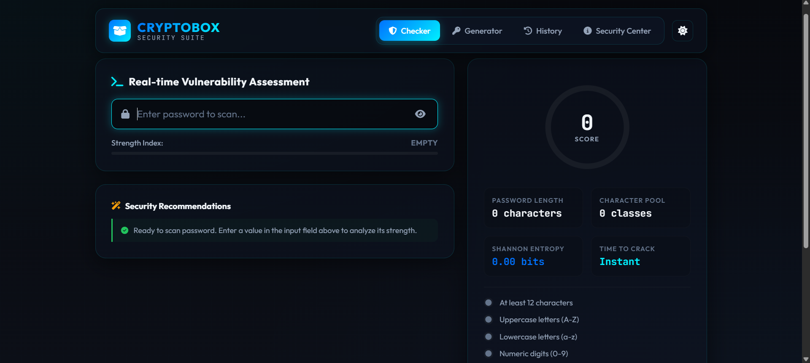
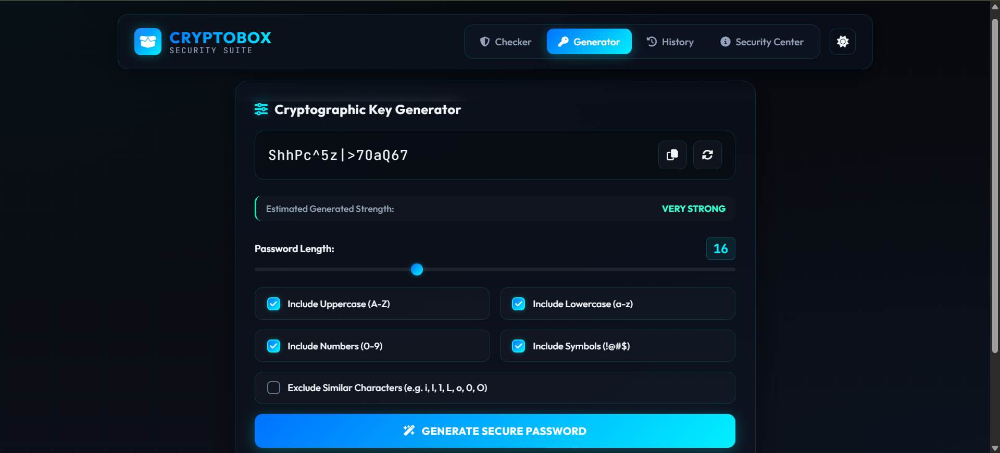
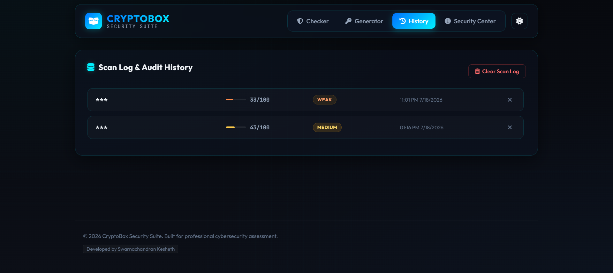
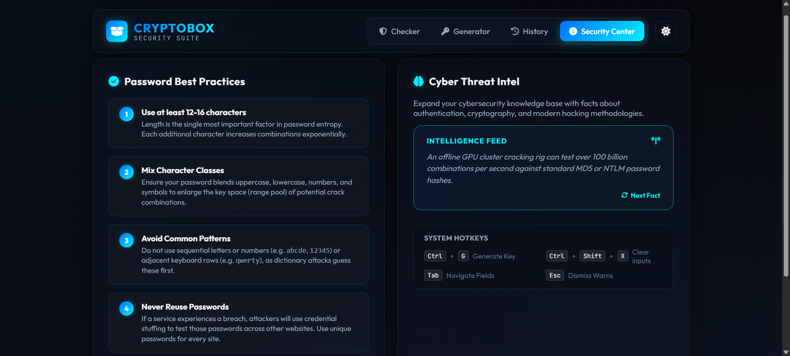
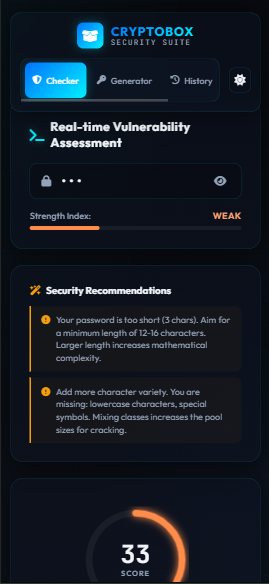

# CryptoBox – Password Strength Checker

CryptoBox is a modern, production-quality, responsive cybersecurity web application that helps users evaluate password strength, analyze security vulnerabilities, generate cryptographically-secure random passwords, and learn secure password practices. 

Designed with a premium glassmorphic dark theme, neon blue and cyan accents, and clean micro-animations, it serves as a stunning cybersecurity portfolio piece.

## Features

- **Real-Time Password Checker**: Evaluates password strength dynamically as you type with a visual circular gauge.
- **Vulnerability Analysis Checklist**: Checks for uppercase, lowercase, numbers, symbols, spaces, repeating characters, sequential runs (`abcde`, `12345`), and common passwords.
- **Common Password Detection**: Scans inputs against a database of 200+ common passwords (like `123456`, `password`, `admin`, `qwerty`) and raises warning flags.
- **Estimated Crack Time Calculator**: Computes offline cracking times based on entropy and range pools, assuming a high-speed GPU cracking cluster (10 billion guesses/second).
- **Advanced Password Generator**: Includes length selection (8-32), individual character pool choices, similar character exclusion, and a quick-strength meter.
- **Secure Password History**: Stores scan results locally using browser `localStorage` with masked passwords to respect user privacy and security.
- **Cybersecurity Fact Rotator**: Displays rotating security facts and stats.
- **Light & Dark Mode**: Seamless toggle that shifts the visual styles from neon dark to high-contrast light.
- **Accessibility & Shortcuts**:
  - Full keyboard navigation.
  - Interactive toast notifications.
  - Keyboard shortcuts (`Ctrl + G` to generate, `Ctrl + Shift + X` to clear inputs).

## Installation & Deployment

Since CryptoBox is built entirely with pure HTML5, CSS3, and Vanilla JavaScript (no compile step or backend required), running and deploying it is extremely simple:

1. Clone or download the repository.
2. Open `index.html` in any web browser.
3. To deploy, simply upload the project folder to GitHub Pages, Netlify, or Vercel.

## File Structure

```
CryptoBox/
│
├── index.html     # Application structure, layouts, and SVG components
├── style.css      # Custom styles, theme variables, glassmorphic effects, and transitions
├── script.js      # Password analysis engine, UI logic, generator, and local storage state
└── README.md      # Project documentation
```

## Security Best Practices Demonstrated
- **No Cleartext Storing**: Evaluated passwords are never transmitted to any server. History is stored purely in the client's local browser using standard masking techniques.
- **GPU Cracking Model**: Crack times are calculated based on modern offline hashing speeds, illustrating real-world hazards.


# 📸 Screenshots

## 🔐 Password Checker



---

## ⚡ Password Generator



---

## 📜 Password History



---

## 🛡️ Security Analysis



---

## 📱 Mobile View


